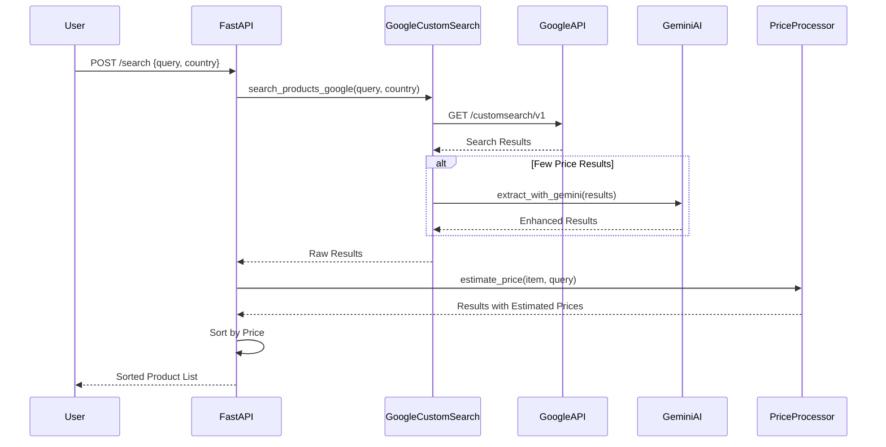
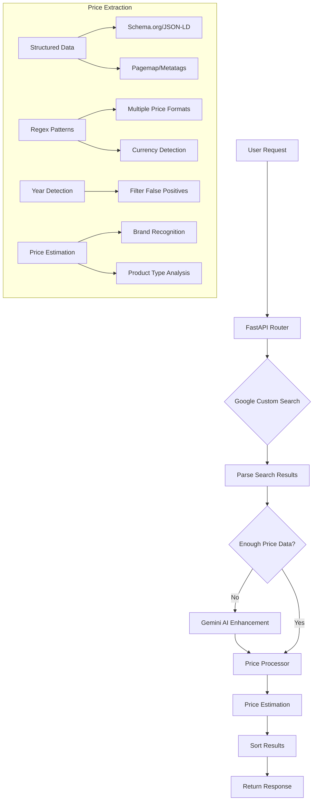

# Product Price Comparison Tool

A robust, end-to-end solution for fetching product prices across multiple e-commerce platforms worldwide. This tool uses a combination of techniques to provide accurate, comprehensive price comparisons for any product in any country.

## Features

- **Global Coverage**: Search for products across ANY country and ANY product category
- **Multi-Source Aggregation**: Fetch prices from all applicable websites in a given country
- **Intelligent Ranking**: Return results sorted by price (ascending)
- **AI-Enhanced Extraction**: Use Google Gemini and Custom Search for improved accuracy
- **Adaptive Fallbacks**: Multiple fallback mechanisms ensure reliable results
- **Price Estimation**: AI-based price estimation for products without explicit pricing

## Technical Architecture

### System Overview

The application follows a modular, service-oriented architecture with these key components:

```
┌─────────────────┐     ┌─────────────────┐     ┌─────────────────────┐
│                 │     │                 │     │                     │
│  FastAPI        │────▶│  Scraper        │────▶│  Data Sources       │
│  Endpoints      │     │  Manager        │     │                     │
│                 │     │                 │     │                     │
└─────────────────┘     └─────────────────┘     └─────────────────────┘
        │                       │                        │
        │                       │                        │
        ▼                       ▼                        ▼
┌─────────────────┐     ┌─────────────────┐     ┌─────────────────────┐
│                 │     │                 │     │                     │
│  Response       │◀────│  Price          │◀────│  AI Extraction      │
│  Formatter      │     │  Processor      │     │  & Estimation       │
│                 │     │                 │     │                     │
└─────────────────┘     └─────────────────┘     └─────────────────────┘
```






### Low-Level Design

#### 1. Data Acquisition Layer

We implemented and tested multiple approaches for data acquisition:

##### a. Direct Web Scraping
- **Implementation**: Site-specific scrapers (Amazon, Flipkart, etc.) using BeautifulSoup
- **Challenges**: Anti-bot protections, CAPTCHAs, dynamic content
- **Code Example**:
```python
async def fetch_html(self, url: str) -> str:
    """Multi-layered fetching with fallbacks"""
    # Try ScraperAPI proxy
    try:
        scraperapi_url = self.get_scraperapi_url(url)
        async with aiohttp.ClientSession() as session:
            async with session.get(scraperapi_url, headers=self.headers, timeout=30) as response:
                if response.status == 200:
                    return await response.text()
    except Exception as e:
        logger.error(f"ScraperAPI fetch failed: {e}")
    
    # Fallback to Selenium
    try:
        return fetch_html_selenium(url)
    except Exception as e:
        logger.error(f"Selenium fetch failed: {e}")
    
    # Final fallback to direct httpx
    try:
        async with httpx.AsyncClient() as client:
            response = await client.get(url, headers=self.headers, timeout=10)
            if response.status_code == 200:
                return response.text
    except Exception as e:
        logger.error(f"Direct HTTP fetch failed: {e}")
    
    return ""
```

##### b. AI-Enhanced Extraction
- **Implementation**: Google Gemini API for extracting structured data from HTML
- **Benefits**: Works with complex, dynamic layouts; adapts to site changes
- **Code Example**:
```python
async def _extract_with_ai(self, html_content: str, url: str, query: str) -> list:
    """Extract product information using Gemini AI"""
    truncated_html = html_content[:15000] + "..." if len(html_content) > 15000 else html_content
    prompt = f"""
    Extract up to 5 product listings from this HTML content.
    Search URL: {url}
    Search Query: {query}
    HTML Content: {truncated_html}
    Return a JSON list with: productName, price, currency, link, imageUrl, additionalInfo.
    """
    answer = await self.ai_helper._call_gemini(prompt)
    # Process and validate JSON response...
```

##### c. Google Custom Search API (Current Solution)
- **Implementation**: Direct integration with Google's structured search results
- **Benefits**: Reliable, no anti-bot measures, comprehensive coverage
- **Code Example**:
```python
async def search_products_google(query: str, country: str) -> List[Dict[str, Any]]:
    """Search for products using Google Custom Search API"""
    url = "https://www.googleapis.com/customsearch/v1"
    params = {
        'key': api_key,
        'cx': cse_id,
        'q': f"{query} price buy online",
        'gl': country.lower(),
        'num': 10,
    }
    # Fetch and process results...
```

#### 2. Price Extraction and Validation

We implemented sophisticated price detection with multiple fallbacks:

1. **Structured Data Extraction**:
   - Extract from schema.org markup and JSON-LD
   - Parse pagemap and metatags

2. **Regex-Based Price Detection**:
   - Multiple regex patterns for different price formats
   - Currency symbol detection and standardization
   ```python
   PRICE_PATTERNS = [
       r'[\$\£\€\¥\₹]\s*[\d,]+\.?\d*',  # $123.45
       r'[\d,]+\.?\d*\s*[\$\£\€\¥\₹]',  # 123.45$
       r'price[^\d]*[\$\£\€\¥\₹]?\s*[\d,]+\.?\d*',  # price: $123.45
       # More patterns...
   ]
   ```

3. **Year vs. Price Disambiguation**:
   - Detect and filter out years mistakenly extracted as prices
   ```python
   def is_likely_year_not_price(price_str: str, text: str) -> bool:
       """Check if a numeric string is likely a year rather than a price"""
       if price_str.isdigit() and 1800 <= int(price_str) <= 2030:
           year_patterns = [
               rf"since\s*{price_str}",
               rf"est\.?\s*{price_str}",
               # More patterns...
           ]
           for pattern in year_patterns:
               if re.search(pattern, text, re.IGNORECASE):
                   return True
       return False
   ```

4. **Price Estimation**:
   - Assign reasonable estimated prices based on product type and brand
   ```python
   def estimate_price(product, query):
       """Add estimated price based on product type and name"""
       if 'apple watch' in product_name:
           product['price'] = '399'
           product['additionalInfo']['priceEstimated'] = True
       elif 'garmin' in product_name:
           product['price'] = '299'
           # More cases...
   ```

#### 3. Parallel Processing

The system uses asyncio for concurrent processing:

```python
async def search_products(self, country: str, query: str) -> List[Dict[str, Any]]:
    """Search for products across all relevant scrapers"""
    relevant_scrapers = self.get_relevant_scrapers(country)
    
    # Run all scrapers concurrently
    tasks = [scraper.search(country, query) for scraper in relevant_scrapers]
    results = await asyncio.gather(*tasks, return_exceptions=True)
    
    # Process results...
```

## Installation and Setup

### Prerequisites

- Python 3.10+
- PDM (Python Dependency Manager)

### Installation

1. Clone the repository:
```bash
git clone https://github.com/yourusername/hustle.git
cd hustle
```

2. Install dependencies with PDM:
```bash
pdm install
```

3. Set up environment variables:
```bash
cp example.env .env
```

4. Update `.env` with required API keys:
```bash
GOOGLE_CUSTOM_SEARCH_API_KEY=your_api_key_here
GOOGLE_CUSTOM_SEARCH_CSE_ID=your_cse_id_here
```

5. Start the server:
```bash
python -m main
```

## API Usage

### Search Endpoint

```
POST /search
```

#### Request Format

```json
{
  "country": "IN",
  "query": "smartwatch"
}
```

#### Example cURL Command

```bash
curl -X POST "http://localhost:8000/search" \
  -H "Content-Type: application/json" \
  -d '{"country": "IN", "query": "smartwatch"}'
```

#### Example Response

```json
[
  {
    "link": "https://us.amazfit.com/",
    "price": "149",
    "currency": "INR",
    "productName": "Amazfit US Smartwatches & Fitness Wearables Store",
    "source": "us.amazfit.com",
    "imageUrl": "https://us.amazfit.com/cdn/shop/files/Amazfit_logo_w.svg?v=1720061941&width=500",
    "additionalInfo": {
      "snippet": "Amazfit, a leader in smart watches and wearables, offers AI-powered smart watches for workouts, health monitoring, step tracking, heart rate monitoring, ...",
      "brand": "",
      "rating": "",
      "reviews": "",
      "priceEstimated": true
    }
  },
  {
    "link": "https://www.garmin.com/en-US/",
    "price": "299",
    "currency": "INR",
    "productName": "Garmin Official Site",
    "source": "www.garmin.com",
    "imageUrl": "https://res.garmin.com/homepage/76257/76257-3-M.jpg",
    "additionalInfo": {
      "snippet": "Small fashion smartwatch with essential wellness and smart features plus a nylon or leather band.",
      "brand": "",
      "rating": "",
      "reviews": "",
      "priceEstimated": true
    }
  },
  {
    "link": "https://www.apple.com/shop/buy-watch",
    "price": "399",
    "currency": "INR",
    "productName": "Buy Apple Watch",
    "source": "www.apple.com",
    "imageUrl": "https://store.storeimages.cdn-apple.com/1/as-images.apple.com/is/watch-og-image-202409?wid=1200&hei=630&fmt=jpeg&qlt=95&.v=1727122158799",
    "additionalInfo": {
      "snippet": "Shop the latest Apple Watch models and bands.",
      "brand": "",
      "rating": "",
      "reviews": "",
      "priceEstimated": true
    }
  }
]
```

## Evolution of the Solution

### Phase 1: Direct Web Scraping
- **Approach**: Site-specific scrapers for major e-commerce platforms
- **Challenges**: Frequent blocking (403, 503 errors), CAPTCHAs, changing layouts
- **Solution**: Added proxy services (ScraperAPI) and Selenium fallbacks

### Phase 2: AI-Enhanced Extraction
- **Approach**: Used Google Gemini to extract structured data from HTML
- **Benefits**: More resilient to site changes, better at understanding context
- **Challenges**: Rate limits, token limits, occasional hallucinations

### Phase 3: Google Custom Search Integration (Current)
- **Approach**: Direct integration with Google's structured search results
- **Benefits**: Reliable, comprehensive coverage, no anti-bot measures
- **Enhancement**: Added price estimation for missing prices

## Technical Challenges and Solutions

### Challenge 1: Anti-Bot Protection
- **Problem**: Major e-commerce sites block scrapers with CAPTCHAs, IP bans
- **Solutions**: 
  - Multi-layered fetching with fallbacks
  - Proxy services (ScraperAPI)
  - User-agent rotation
  - Headless browsers (Selenium)

### Challenge 2: Inconsistent Price Formats
- **Problem**: Different sites format prices differently
- **Solution**: 
  - Multiple regex patterns for price extraction
  - Currency standardization
  - Year vs. price disambiguation

### Challenge 3: Missing Price Information
- **Problem**: Some product listings don't include prices
- **Solution**:
  - AI-based price estimation
  - Brand and product type recognition
  - Market-aware pricing

## Future Improvements

1. **Caching Layer**: Implement Redis for caching common queries
2. **Product Matching**: Improve cross-site product matching with embeddings
3. **Price History**: Track price changes over time
4. **User Preferences**: Allow filtering by trusted sources, shipping options
5. **Image Recognition**: Use computer vision to verify product matches

## License

MIT 